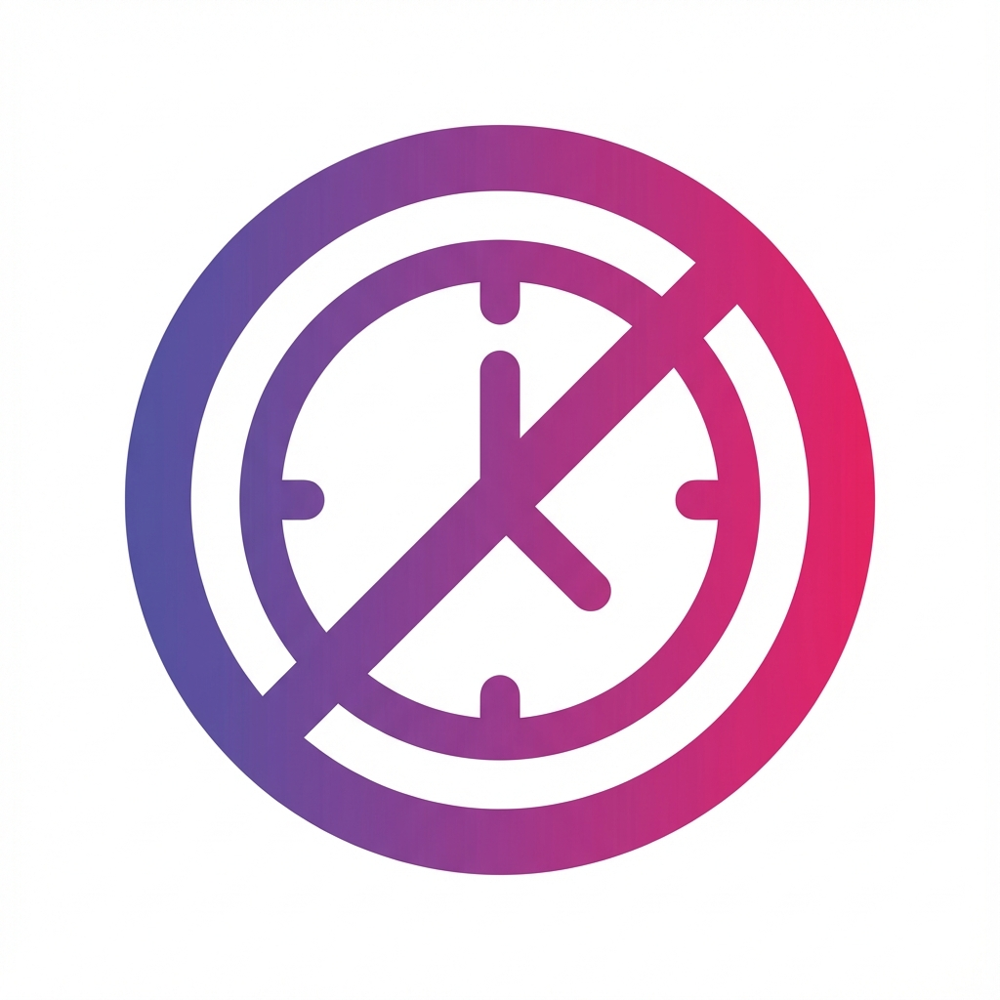

# DistBlock - Time-Based Website Blocker 
# TS still a WIP (trying to weebify the ui)

A beautiful Firefox extension that helps you stay focused by blocking distracting websites during specific times of the day. Built with **Material Design 3 Expressive** for a stunning, modern interface.



## ✨ Features

- ⏰ **Time-Based Blocking** - Schedule website blocks for specific hours
- 📅 **Day Selection** - Choose which days each schedule is active
- 🎨 **Material Design 3 Expressive** - Beautiful, modern UI with vibrant colors and expressive shapes
- 🔄 **Multiple Schedules** - Create unlimited blocking schedules
- 🌐 **Wildcard Support** - Block entire domains with `*.example.com`
- 💾 **Import/Export** - Backup and restore your settings
- ⚡ **Quick Block** - Instantly block the current site from the popup
- 📊 **Live Status** - See active schedules at a glance
- ⏱️ **Countdown Timer** - Know exactly when sites become available again

## 🚀 Installation

### From Source (Development)

1. **Clone or download** this repository
2. Open Firefox and navigate to `about:debugging`
3. Click **"This Firefox"** in the left sidebar
4. Click **"Load Temporary Add-on"**
5. Navigate to the extension directory and select the `manifest.json` file
6. The extension is now installed!

### From Firefox Add-ons (Coming Soon)

The extension will be available on the Firefox Add-ons store soon.

## 📖 Usage

### Creating a Schedule

1. Click the **DistBlock icon** in your browser toolbar
2. Click **"Open Settings"**
3. Click the **+ button** to create a new schedule
4. Fill in the details:
   - **Schedule Name** - Give it a meaningful name (e.g., "Work Hours")
   - **Time Range** - Set start and end times
   - **Active Days** - Select which days this schedule applies
   - **Websites** - Enter websites to block (one per line)
5. Click **"Save Schedule"**

### Quick Block Current Site

1. Navigate to the website you want to block
2. Click the **DistBlock icon**
3. Click **"Block This Site"**
4. Configure the schedule in the settings page

### Managing Schedules

- **Edit** - Click on any schedule card or the edit icon
- **Delete** - Click the trash icon on a schedule card
- **Enable/Disable** - Toggle the switch when editing a schedule

### Import/Export Settings

- **Export** - Click "Export" in settings to download your configuration
- **Import** - Click "Import" and select a previously exported JSON file

## 🎨 Material Design 3 Expressive

This extension showcases Google's **Material Design 3 Expressive** design language:

- **Vibrant Color Palettes** - Dynamic primary, secondary, and tertiary colors
- **Expressive Shapes** - Large rounded corners (up to 32px)
- **Elevation System** - Sophisticated shadows and depth
- **Typography Scale** - Google Sans and Roboto fonts
- **State Layers** - Smooth hover and interaction effects
- **Motion & Animation** - Emphasized easing and dynamic transitions

## 🛠️ Technical Details

### File Structure

```
DistBlock/
├── manifest.json              # Extension manifest
├── background.js              # Background service for blocking
├── icons/                     # Extension icons
├── styles/
│   └── material-theme.css     # Material Design 3 theme system
├── scripts/
│   ├── storage.js            # Storage utilities
│   └── time-utils.js         # Time calculation utilities
├── popup/                     # Browser action popup
│   ├── popup.html
│   ├── popup.css
│   └── popup.js
├── options/                   # Settings page
│   ├── options.html
│   ├── options.css
│   └── options.js
└── blocked/                   # Blocked page
    ├── blocked.html
    ├── blocked.css
    └── blocked.js
```

### Permissions

- `webRequest` & `webRequestBlocking` - Intercept and block website requests
- `storage` - Save schedules and settings
- `tabs` - Redirect blocked tabs
- `<all_urls>` - Monitor all website access

### Browser Compatibility

- **Firefox** - Fully supported (Manifest V2)
- **Chrome/Edge** - Requires conversion to Manifest V3 (coming soon)

## 🤝 Contributing

Contributions are welcome! Feel free to:

- Report bugs
- Suggest new features
- Submit pull requests
- Improve documentation

## 📝 License

MIT License - Feel free to use and modify as needed.

## 🎯 Roadmap

- [ ] Chrome/Edge support (Manifest V3)
- [ ] Sync settings across devices
- [ ] Statistics and productivity insights
- [ ] Break reminders
- [ ] Focus mode with Pomodoro timer
- [ ] Custom themes

## 💡 Tips

- Use wildcards (`*.reddit.com`) to block all subdomains
- Create separate schedules for different types of activities
- Export your settings regularly as a backup
- Use the countdown timer to plan your breaks

---

**Stay focused. Stay productive. DistBlock.**
